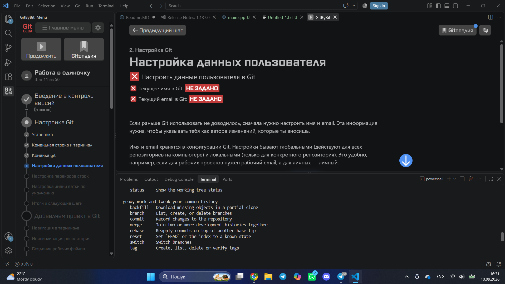

# Лаба 1 web technolies

скачано git 

задава своє ім’я 

написав пошту

налаштував перенос строк

налаштував ім’я вітки по замовчуванню 

завершив вводний тест

ініціалізував репозитрій 

Добавив у staging стан папку

закомітив файл 

перевірив стан 

пройшов тест

скасував дії останнього коміту 

добавив теги 

скасував дії останнього коміту 

закомітив нові зміни 

поміняв останнє повідомлення в коміті 

Знову поміняв останній коміт 

виконав останній тест 

дав нову версію проєкта 

вивід усіх віток 

закомітив зміни 

поміняв вітку на style 

переключився на вітку main 

злив 2 вітки в 1

успішно 

видалив вітку style 

пройшов final test

потестив варіації git log 

git log 

перевірив git log style css

повернув версію від останнього коміту

зробив 1 завдання 

